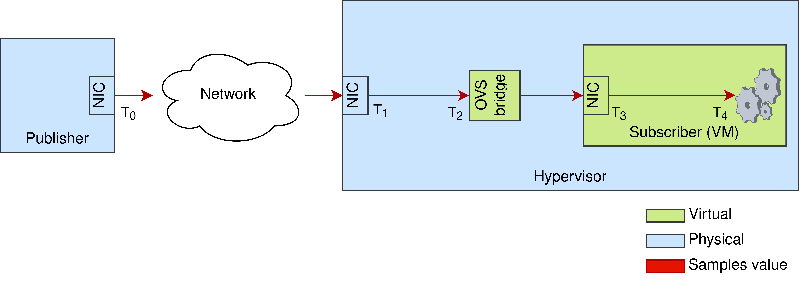

# Seapath performance tool

Seapath performance tool is a tool used to evaluate the performance of a Seapath
standalone infrastructure.

## Table of Contents

- [Introduction](#introduction)
- [Features](#features)
- [Installation](#installation)
- [Configuration](#configuration)
- [Usage](#usage)

## Introduction

Seapath performance tool focuses on assessing the efficiency and reliability of a
Seapath architecture by performing network latency tests. Using
IEC61850 protocol, Samples Value are emitted from a publisher machine
in destination of a subscriber machine, which will receive, parse, and
decode them. The subscriber machine can be a physical machine or a
virtual machine hosted on a hypervisor.

NOTE: Each of the machine used are running a Seapath standalone
distribution. There is currently no support for a Seapath cluster
configuration.

Various latency metrics are computed at various stage of the transit of the Samples
Value between each machine, and inside them:


- Network latency: Time elapsed between the emission of an SV (T0) from the
  publisher machine to the NIC of the subscriber (T3) or of the
  hypervisor machine (T1).
- Hypervisor latency: Time elapsed between the reception of an SV on
  the NIC of the hypervisor machine (T1) to the end of the processing of
  it (T2). This latency is computed only in the
  context of a virtualized subscriber.
- Transit latency: Time elapsed between the end of the processing of an SV on
  the hypervisor machine (T2) to the reception of the SV on the NIC
  of the subscriber machine (T3). This latency is computed only in the
  context of a virtualized subscriber.
- Subscriber latency: Time elapsed between the reception of an SV on
  the NIC of the subscriber (T3) machine to the end of the processing of
  it (T4).

At the end of each test, are generated various graphs and a test report
in `tests_results` directory.

This project is essential for ensuring that the Seapath platform meets
the stringent requirements of real-time applications, particularly in
the power grid industry.

## Features

- High precision and reliable latency test (+/- 10µs)
- Identify bottleneck in a Seapath architecture (hypervisor, subscriber)
- Identify bottleneck inside a Seapath machine

## Installation
### Requirements
#### System packages

Make sure your localhost system complies with the following dependencies:
```bash
sudo apt install \
docker
```

Install `cqfd`:
```bash
git clone https://github.com/savoirfairelinux/cqfd.git
cd cqfd
sudo make install
```

#### Seapath machine

A valid IEC61850 PCAP file is needed on the publisher machine. The
selection of this file can be achieved using `pcap_file` inventory
variable.

In order to access kernel symbol names, kernel addresses must be
exposed with file `/proc/sys/kernel/kptr_restrict`.

## Configuration
###  Time synchronization
#### Network cards

In order to properly log the Seapath latency, the clock of the network card receiving the Sample Values must be synchronized in PTP. This is done :
- Automatically if you use the same network card to receive the PTP frames and the SV
- Manually, using phc2sys to synchronize the SV network card with the PTP one

This is **not done by Ansible and must be handled by the user**

#### System

For achieving high accuracy latency measure each machine must be
synchronized using the PTP protocol.
To implement PTP on Seapath you can follow the detailed procedure in
the Seapath Wiki, section "Time synchronization":
https://wiki.lfenergy.org/display/SEAP/Time+synchronization

For better PTP performance, we recommend:
- The isolation, if possible of `ptp4l` and `phc2sys` process
- To use an hardware PTP source
- To use PTP L2 network transport and P2P delay mechanism
- To use linreg clock servo for `ptp4l` and `phc2sys` configuration
- In the case of a virtual machine as a subscriber, using `kvm_ptp`
module is highly recommended.

For the Seapath performance tool project, PTP can be configured on Seapath machine
without `timemaster` package. To do so:

1. Make sure `ptp4l` and `phc2sys` utilities are installed on each
Seapath machine
2. `timemaster.service` is disabled on each Seapath machine:
```bash
systemctl disable timemaster.service
```

3. PTP variables are correctly configured in your Seapath performance tool inventories
files; See README file in `inventories/` directory. In particular, make
sure `ptp_manual_configuration` is defined.
4. Finally, you can run the playbook `configure_latency_tests.yaml` using:
```bash
cqfd -b configure_tests
```

### Synchronizing

### General configuration

Seapath machines configuration for the Seapath performance tool project can be set in
the dedicated inventories files. See `inventories/README` for more
information.

The configuration can be applied with the `configure_latency_tests.yaml` playbook:

```bash
cqfd -b configure_tests
```

NOTE: this playbook must be run again each time a variable is modified in a
Seapath performance tool inventory.

## Usage

After configuration, the tests can be launched with the playbook
`run_latency_tests.yaml`:
```bash
cqfd -b run_tests
```

Test duration can be set achieved using `pcap_cycles` inventory
variable.

The threshold of latency variables can be set in the var file
`threshold.yaml`. To record all SV data, set the threshold value to 0.

For CI purpose, you can also use the `launch_tests.sh` script.

## Release notes

### Version v0.1

* Configuration of the target
* Hypervisor, subscriber, and total latency measurement
* Generation of plot results and .adoc report

### Version v0.2

* Add an iteration counter to identify each SV as unique no matter the time of the test
* Correct a bug where some sample values appeared as duplicated in bpftrace logs
* Introduce and automate the computation of Tseapath
* Add Ttot selection in `vars/threshold.yaml`
